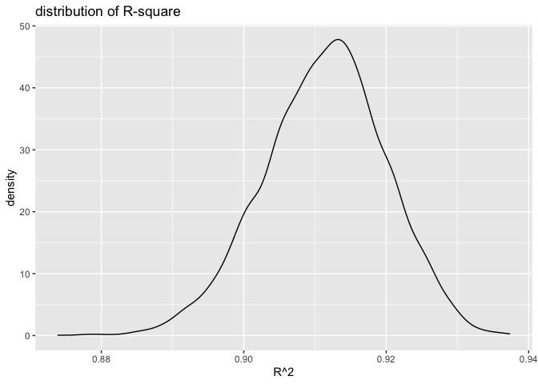

p8105\_hw6\_jl6049
================
LYU JING
11/27/2021

``` r
library(ALSM)
library(modelr)
library(tidyverse)
```

# Problem 1

**Load and clean the data for regression analysis**

``` r
birthweight = read.csv("birthweight.csv")
```

``` r
skimr::skim(birthweight)
```

|                                                  |             |
|:-------------------------------------------------|:------------|
| Name                                             | birthweight |
| Number of rows                                   | 4342        |
| Number of columns                                | 20          |
| \_\_\_\_\_\_\_\_\_\_\_\_\_\_\_\_\_\_\_\_\_\_\_   |             |
| Column type frequency:                           |             |
| numeric                                          | 20          |
| \_\_\_\_\_\_\_\_\_\_\_\_\_\_\_\_\_\_\_\_\_\_\_\_ |             |
| Group variables                                  | None        |

Data summary

**Variable type: numeric**

| skim\_variable | n\_missing | complete\_rate |    mean |     sd |     p0 |     p25 |     p50 |     p75 |   p100 | hist  |
|:---------------|-----------:|---------------:|--------:|-------:|-------:|--------:|--------:|--------:|-------:|:------|
| babysex        |          0 |              1 |    1.49 |   0.50 |   1.00 |    1.00 |    1.00 |    2.00 |    2.0 | ▇▁▁▁▇ |
| bhead          |          0 |              1 |   33.65 |   1.62 |  21.00 |   33.00 |   34.00 |   35.00 |   41.0 | ▁▁▆▇▁ |
| blength        |          0 |              1 |   49.75 |   2.72 |  20.00 |   48.00 |   50.00 |   51.00 |   63.0 | ▁▁▁▇▁ |
| bwt            |          0 |              1 | 3114.40 | 512.15 | 595.00 | 2807.00 | 3132.50 | 3459.00 | 4791.0 | ▁▁▇▇▁ |
| delwt          |          0 |              1 |  145.57 |  22.21 |  86.00 |  131.00 |  143.00 |  157.00 |  334.0 | ▅▇▁▁▁ |
| fincome        |          0 |              1 |   44.11 |  25.98 |   0.00 |   25.00 |   35.00 |   65.00 |   96.0 | ▃▇▅▂▃ |
| frace          |          0 |              1 |    1.66 |   0.85 |   1.00 |    1.00 |    2.00 |    2.00 |    8.0 | ▇▁▁▁▁ |
| gaweeks        |          0 |              1 |   39.43 |   3.15 |  17.70 |   38.30 |   39.90 |   41.10 |   51.3 | ▁▁▂▇▁ |
| malform        |          0 |              1 |    0.00 |   0.06 |   0.00 |    0.00 |    0.00 |    0.00 |    1.0 | ▇▁▁▁▁ |
| menarche       |          0 |              1 |   12.51 |   1.48 |   0.00 |   12.00 |   12.00 |   13.00 |   19.0 | ▁▁▂▇▁ |
| mheight        |          0 |              1 |   63.49 |   2.66 |  48.00 |   62.00 |   63.00 |   65.00 |   77.0 | ▁▁▇▂▁ |
| momage         |          0 |              1 |   20.30 |   3.88 |  12.00 |   18.00 |   20.00 |   22.00 |   44.0 | ▅▇▂▁▁ |
| mrace          |          0 |              1 |    1.63 |   0.77 |   1.00 |    1.00 |    2.00 |    2.00 |    4.0 | ▇▇▁▁▁ |
| parity         |          0 |              1 |    0.00 |   0.10 |   0.00 |    0.00 |    0.00 |    0.00 |    6.0 | ▇▁▁▁▁ |
| pnumlbw        |          0 |              1 |    0.00 |   0.00 |   0.00 |    0.00 |    0.00 |    0.00 |    0.0 | ▁▁▇▁▁ |
| pnumsga        |          0 |              1 |    0.00 |   0.00 |   0.00 |    0.00 |    0.00 |    0.00 |    0.0 | ▁▁▇▁▁ |
| ppbmi          |          0 |              1 |   21.57 |   3.18 |  13.07 |   19.53 |   21.03 |   22.91 |   46.1 | ▃▇▁▁▁ |
| ppwt           |          0 |              1 |  123.49 |  20.16 |  70.00 |  110.00 |  120.00 |  134.00 |  287.0 | ▅▇▁▁▁ |
| smoken         |          0 |              1 |    4.15 |   7.41 |   0.00 |    0.00 |    0.00 |    5.00 |   60.0 | ▇▁▁▁▁ |
| wtgain         |          0 |              1 |   22.08 |  10.94 | -46.00 |   15.00 |   22.00 |   28.00 |   89.0 | ▁▁▇▁▁ |

The dataset has No missing. But `pnumlbw` and `pnumsga` are all zero, so
cancel those two columns. Then, Convert several numeric variables to
factor.

``` r
birthweight_clean =birthweight %>% 
  select(-pnumlbw,-pnumsga) %>% 
  mutate(babysex = factor(babysex),
         frace = factor(frace),
         malform = factor(malform),
         mrace = factor(mrace))
```

**Propose a regression model for birthweight.**

Use functions below to find out proper variables to fit our model.

``` r
variables = birthweight %>% select(-bwt,-pnumlbw,-pnumsga)

cor(variables)

variables = variables %>% select(-frace,-ppbmi,-ppwt,-ppbmi) 


BestSub(variables,birthweight$bwt) # best subset

variables = variables %>% select(-malform) 
```

Use `cor()` to find out correlation between variables:

-   `ppwt`,`ppbmi` ,`delwt` and `wtgain` have relation, so I only keep
    `wtgain` and`delwt`.
-   `mrace` and `frace` are correlated to each other, so only keep
    `mrace`

Use `BestSub()`:

-   `malform` seems not influence the model a lot so cancel it.

Based on the understanding, I guess `fincme` and `momage`and `menarche`
are not relevant to response. So I try to figure this out by evaluating
p values of those variables in a lm model.

``` r
fit = lm(bwt ~ babysex + bhead + blength +delwt + fincome + gaweeks + menarche + mheight + momage + mrace  +parity +smoken+  wtgain , data = birthweight_clean)
summary(fit)
```

    ## 
    ## Call:
    ## lm(formula = bwt ~ babysex + bhead + blength + delwt + fincome + 
    ##     gaweeks + menarche + mheight + momage + mrace + parity + 
    ##     smoken + wtgain, data = birthweight_clean)
    ## 
    ## Residuals:
    ##      Min       1Q   Median       3Q      Max 
    ## -1095.57  -185.07    -3.22   173.66  2342.79 
    ## 
    ## Coefficients:
    ##               Estimate Std. Error t value Pr(>|t|)    
    ## (Intercept) -6077.6038   140.2391 -43.337  < 2e-16 ***
    ## babysex2       28.6376     8.4593   3.385 0.000717 ***
    ## bhead         130.8308     3.4474  37.950  < 2e-16 ***
    ## blength        74.9102     2.0198  37.087  < 2e-16 ***
    ## delwt           1.3800     0.2357   5.854 5.15e-09 ***
    ## fincome         0.2905     0.1791   1.622 0.104816    
    ## gaweeks        11.5597     1.4644   7.894 3.69e-15 ***
    ## menarche       -3.6401     2.8904  -1.259 0.207963    
    ## mheight         6.8604     1.7989   3.814 0.000139 ***
    ## momage          0.7656     1.2199   0.628 0.530319    
    ## mrace2       -137.2019    10.2102 -13.438  < 2e-16 ***
    ## mrace3        -74.6165    42.7167  -1.747 0.080747 .  
    ## mrace4        -99.4288    19.3652  -5.134 2.95e-07 ***
    ## parity         95.4592    40.4542   2.360 0.018335 *  
    ## smoken         -4.8279     0.5857  -8.243  < 2e-16 ***
    ## wtgain          2.7205     0.4325   6.290 3.50e-10 ***
    ## ---
    ## Signif. codes:  0 '***' 0.001 '**' 0.01 '*' 0.05 '.' 0.1 ' ' 1
    ## 
    ## Residual standard error: 272.3 on 4326 degrees of freedom
    ## Multiple R-squared:  0.7182, Adjusted R-squared:  0.7172 
    ## F-statistic: 735.1 on 15 and 4326 DF,  p-value: < 2.2e-16

I find out `fincome` and `momage`and `menarche` is not significant then
cancel it.

Fit the final model:

``` r
fit_final = lm(bwt ~ babysex + bhead + blength +delwt + gaweeks + mheight + mrace  +parity +smoken+  wtgain , data = birthweight_clean)
summary(fit_final)
```

    ## 
    ## Call:
    ## lm(formula = bwt ~ babysex + bhead + blength + delwt + gaweeks + 
    ##     mheight + mrace + parity + smoken + wtgain, data = birthweight_clean)
    ## 
    ## Residuals:
    ##      Min       1Q   Median       3Q      Max 
    ## -1106.16  -183.65    -2.51   174.67  2338.68 
    ## 
    ## Coefficients:
    ##               Estimate Std. Error t value Pr(>|t|)    
    ## (Intercept) -6101.8188   137.5732 -44.353  < 2e-16 ***
    ## babysex2       28.3735     8.4565   3.355 0.000800 ***
    ## bhead         131.0228     3.4448  38.035  < 2e-16 ***
    ## blength        74.7933     2.0178  37.066  < 2e-16 ***
    ## delwt           1.4333     0.2320   6.179 7.04e-10 ***
    ## gaweeks        11.6785     1.4617   7.990 1.72e-15 ***
    ## mheight         6.8569     1.7795   3.853 0.000118 ***
    ## mrace2       -145.3753     9.2256 -15.758  < 2e-16 ***
    ## mrace3        -77.9781    42.2918  -1.844 0.065279 .  
    ## mrace4       -105.9871    19.1083  -5.547 3.09e-08 ***
    ## parity         94.8103    40.3386   2.350 0.018800 *  
    ## smoken         -4.8738     0.5855  -8.324  < 2e-16 ***
    ## wtgain          2.6507     0.4273   6.204 6.02e-10 ***
    ## ---
    ## Signif. codes:  0 '***' 0.001 '**' 0.01 '*' 0.05 '.' 0.1 ' ' 1
    ## 
    ## Residual standard error: 272.4 on 4329 degrees of freedom
    ## Multiple R-squared:  0.7179, Adjusted R-squared:  0.7171 
    ## F-statistic:   918 on 12 and 4329 DF,  p-value: < 2.2e-16

**Show a plot of model residuals against fitted values**

``` r
birthweight_clean %>% 
  add_predictions(fit_final) %>% 
  add_residuals(fit_final) %>% 
  ggplot(aes(x = pred, y = resid)) + geom_point(alpha = 0.1) +
  labs(
    title = "plot of model residuals against fitted values", 
    x = "Predict values",
    y = "Residuals"
  ) 
```

<!-- -->

**Compare my model to two other models**

-   One using length at birth and gestational age as predictors (main
    effects only)
-   One using head circumference, length, sex, and all interactions
    (including the three-way interaction) between these

``` r
fit_main = lm(bwt ~ blength + gaweeks, data = birthweight_clean)

fit_interaction = lm(bwt ~ babysex + bhead + blength + babysex*bhead+bhead*blength+babysex*blength+babysex*bhead*blength , data = birthweight_clean)
```

Make this comparison in terms of the cross-validated prediction error;

``` r
cv_df = 
  crossv_mc(birthweight_clean, 100) %>% 
  mutate(
    train = map(train, as_tibble),
    test = map(test, as_tibble)) %>% 
  mutate(
    fit_final  = map(train, ~lm(bwt ~ babysex + bhead + blength +delwt + gaweeks + mheight + mrace  +parity +smoken+  wtgain , data = .x)),
    fit_main  = map(train, ~ lm(bwt ~ blength + gaweeks, data = .x)),
    fit_interaction  = map(train, ~lm(bwt ~ babysex + bhead + blength + babysex*bhead+bhead*blength+babysex*blength+babysex*bhead*blength , data = .x))) %>% 
  mutate(
    rmse_final = map2_dbl(fit_final, test, ~rmse(model = .x, data = .y)),
    rmse_main = map2_dbl(fit_main, test, ~rmse(model = .x, data = .y)),
    rmse_nteraction = map2_dbl(fit_interaction, test, ~rmse(model = .x, data = .y)))
```

``` r
cv_df %>% 
  select(starts_with("rmse")) %>% 
  pivot_longer(
    everything(),
    names_to = "model", 
    values_to = "rmse",
    names_prefix = "rmse_") %>% 
  mutate(model = fct_inorder(model)) %>% 
  ggplot(aes(x = model, y = rmse)) + geom_violin(aes(fill = model)) +
  labs(
    title = "comparison of the cross-validated prediction error", 
    x = "models",
    y = "rmse"
  ) 
```

<!-- -->

# problem 2

``` r
weather_df = 
  rnoaa::meteo_pull_monitors(
    c("USW00094728"),
    var = c("PRCP", "TMIN", "TMAX"), 
    date_min = "2017-01-01",
    date_max = "2017-12-31") %>%
  mutate(
    name = recode(id, USW00094728 = "CentralPark_NY"),
    tmin = tmin / 10,
    tmax = tmax / 10) %>%
  select(name, id, everything())
```

Use 5000 bootstrap samples and, for each bootstrap sample, produce
estimates of these two quantities

``` r
set.seed(1)
estimates =
  weather_df %>% 
  bootstrap(n = 5000) %>% 
  mutate(
    models = map(strap, ~lm(tmax ~ tmin, data = .x) ),
    results1 = map(models, broom::glance),
    results2 = map(models, broom::tidy)) %>% 
  select(-strap, -models) %>% 
  unnest(results1) %>% 
  select(.id,r.squared,results2) %>% 
  unnest(results2) %>% 
  group_by(.id) %>% 
  summarize(
    r.squared = r.squared,
    logb0b1 = log(prod(estimate))) %>% 
  unique() %>% 
  ungroup()
```

Plot the distribution of your estimates, and describe these in words.

``` r
estimates %>% 
  select(r.squared) %>% 
  ggplot(aes(x = r.squared)) + geom_density() +
  labs(
    title = "distribution of R-square", 
    x = "R^2"
  ) 
```

<!-- -->

The mean of R square distribution is around 0.91, means that the R
squared estimates mostly lays around 0.91. This distribution has a heavy
tail extending to low values, which could means that some bootstrap
samples have quite low R-square. Thus, it indicates that there are some
outliers that their independent variables is not explaining much in the
variation of my dependent variable

``` r
estimates %>% 
  select(logb0b1) %>% 
  ggplot(aes(x = logb0b1)) + geom_density() +
  labs(
    title = "distribution of log(b0*b1)",
    x = "log(b0*b1)")
```

<!-- -->

This distribution of log (*β̂*<sub>0</sub> \* *β̂*<sub>1</sub>) is
generally normal with mean around 2.02, means the estimates mostly lays
around 2.02. But the distribution have a little “shoulder” near 2.025.

``` r
ci_r =
estimates %>%
  summarise(qlow_r = quantile(r.squared,probs = c(0.025)),
            qhigh_r = quantile(r.squared,probs = c(0.975)))

ci_r %>% knitr::kable()
```

|   qlow\_r | qhigh\_r |
|----------:|---------:|
| 0.8936684 | 0.927106 |

``` r
ci_b =
estimates %>%
  summarise(qlow_b = quantile(logb0b1,probs = c(0.025)),
            qhigh_b = quantile(logb0b1,probs = c(0.975)))

ci_b %>% knitr::kable()
```

|  qlow\_b | qhigh\_b |
|---------:|---------:|
| 1.964949 | 2.058887 |
